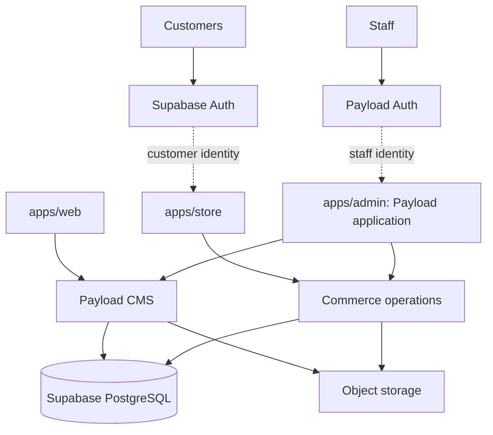
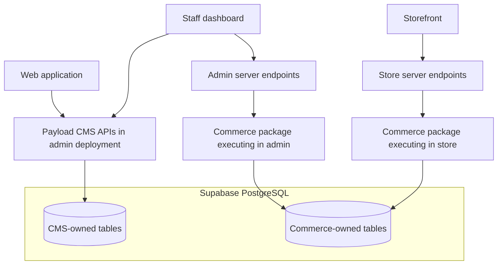

# NUSC platform architecture

Version: Architecture v1.

Status: frozen architectural baseline with preferred implementation details and open decisions identified below; implementation has not started.

Last updated: 12 September 2026.

This document defines the architecture for Nagaland United Sports Club's public website, merchandise store, and staff administration. It records the decisions agreed in planning and identifies details that still require validation. It does not authorize application restructuring, infrastructure provisioning, or deployment.

### Decision terminology

- **Agreed**: architectural direction unless superseded by an ADR.
- **Preferred**: intended implementation or operational default, pending validation.
- **Open**: no decision has been made yet.

Architecture v1 freezes the agreed boundaries, not unverified integration choices. Material changes to those boundaries require an ADR and a document version update. Validation evidence and resolutions of open decisions must be recorded without implying that implementation or production readiness has already been verified.

## Terminology

| Term                               | Meaning                                                                                                                   |
| ---------------------------------- | ------------------------------------------------------------------------------------------------------------------------- |
| Domain owner / authoritative owner | Component responsible for the authoritative model, business rules, migrations, and mutation contract for a data domain    |
| Commerce operation                 | Server-side business operation defined by commerce, such as creating an order or adjusting stock                          |
| Actor context                      | Verified identity and authorization information passed into a protected domain operation                                  |
| Application / app                  | One independently deployable Next.js application: web, store, or admin                                                    |
| Runtime                            | The execution environment in which code runs, such as a browser, an app's server process/function, or a job worker        |
| Contract                           | Owner-defined interface specifying validated inputs, outputs, permissions, error behavior, and compatibility expectations |
| Shared package                     | Library consumed by apps at build time or runtime; not an independently deployed service                                  |

## Context and objectives

NUSC currently has one Next.js and TypeScript application with eight public pages: Home, Club, Honours, Player Pathway, Community, Partners, Careers, and Contact. Content lives in project files. There is no implemented CMS, commerce backend, or database connection.

The target platform adds:

- Staff-managed news, player profiles, fixtures, and other club content.
- A separate store where supporters can browse and purchase football kits and accessories.
- One staff dashboard for editorial work and product/order management, with permissions appropriate to each role.
- Shared NUSC branding while allowing each application to have its own navigation and user experience.

The current application remains the migration starting point. Earlier migration decisions are preserved in [migration-architecture.md](./migration-architecture.md). This document supersedes its file-based content and deferred-commerce assumptions for the target platform.

## Architecture principles

1. Each data domain has one authoritative owner. CMS and commerce ownership must stay explicit.
2. Maintain one commerce product catalogue, including its initial marketing content; do not duplicate it in Payload.
3. Protected operations require server-side authentication and authorization. Privileged commerce state must never be written directly by a browser.
4. Shared packages are libraries, not deployed services. Server-only code and credentials must not enter client bundles.
5. Apps deploy independently. Database, API, and shared-contract changes must tolerate mixed application versions during rollout and rollback.
6. Consumers use domain APIs and contracts rather than another domain's internal tables.
7. Logical data ownership separation is mandatory. Physical schema separation is a preferred, validated implementation choice.
8. External integrations use durable, retry-safe workflows. A shared database does not make remote side effects transactional.

## System overview



This is a logical overview: Payload runs in the admin deployment; commerce operations run server-side within store and admin. Neither box implies a fourth application. Supabase Auth manages customer identities; staff accounts remain Payload-owned. Storage holds file objects, not the authoritative content or product records.

## Agreed decisions

| Decision                | Direction                                                              |
| ----------------------- | ---------------------------------------------------------------------- |
| Repository              | One monorepo                                                           |
| Applications            | Three Next.js and TypeScript apps: `web`, `store`, and `admin`         |
| Public addresses        | Main domain, `shop` subdomain, and `admin` subdomain                   |
| Deployment              | Three independently deployable Vercel projects                         |
| Database                | One shared PostgreSQL database per environment, hosted by Supabase     |
| CMS                     | Payload, connected directly to PostgreSQL and owning CMS data only     |
| Commerce                | Dedicated server-side rules shared by store and admin                  |
| Customer authentication | Supabase Auth                                                          |
| Staff authentication    | Payload Auth initially                                                 |
| Media                   | Object storage for files; database records for metadata and references |

Supabase and Payload are the selected architectural direction, subject to a compatibility check before implementation. Their exact versions, hosting configuration, storage integration, and operational plans are not yet selected. No actual domain name is assumed in this document.

### Assumptions and non-goals

This architecture assumes one club with shared engineering ownership, one database per environment, and an initially custom Next.js storefront. It does not assume a traffic volume, availability target, hosting budget, or completed provider integration.

V1 does not require a fourth commerce service deployment, separate databases, customer/staff SSO, a dedicated search cluster, or a general event-driven platform. Future memberships and ticketing apps are possible extensions, not approved scope. Durable scheduled work may still be necessary for checkout correctness without adopting a broad messaging architecture.

## Repository structure

```text
NUSC/
├── apps/
│   ├── web/                 # Club website
│   ├── store/               # Storefront and customer commerce endpoints
│   └── admin/               # Payload dashboard, CMS APIs, staff endpoints
├── packages/
│   ├── ui/                  # Shared branding and genuinely shared UI
│   ├── commerce/            # Server-only commerce rules and operations
│   ├── commerce-db/         # Commerce persistence, queries, and migrations
│   ├── auth/                # Explicit customer/staff authentication adapters
│   ├── types/               # Shared API contracts and generated type exports
│   └── config/              # Shared lint, TypeScript, and configuration schemas
├── docs/
│   ├── ARCHITECTURE.md
│   ├── PRD.md
│   ├── USER-FLOWS.md
│   ├── IMPLEMENTATION.md
│   └── adr/
└── package.json
```

The current filesystem has been realigned to the three application directories: `apps/web`, `apps/store`, and `apps/admin`. The store currently contains a frontend-only landing preview, and `apps/admin` is a placeholder until Payload/backend work is explicitly authorized. The `packages/` entries remain target conventions to add only as shared responsibilities become concrete. Do not create a generic `utils` package without a defined purpose. `packages/commerce-db` contains commerce schema, queries, migration definitions, and restricted connection utilities. This name replaces the earlier proposed `packages/database` to make its ownership explicit. Payload configuration and its migrations belong to `apps/admin`; they are not independently redefined in this package.

pnpm workspaces and Turborepo are proposed tooling, not prerequisites or installed dependencies. The existing project uses npm. A package-manager change must be deliberate, with one authoritative lockfile.

Shared packages are code, not running services. Server-only packages must not enter browser bundles. Shared authentication utilities do not merge customer and staff identities or sessions.

## Dependency rules

| Consumer               | Allowed dependencies and interfaces                                                                | Must not depend on                                                        |
| ---------------------- | -------------------------------------------------------------------------------------------------- | ------------------------------------------------------------------------- |
| `apps/web`             | Shared UI/config, public CMS contracts and APIs; public commerce API if product previews are added | Commerce persistence, Payload internal tables, another app's source files |
| `apps/store`           | Shared UI/config/contracts; commerce and customer-auth adapters on the server                      | Payload internals or CMS data required to complete checkout               |
| `apps/admin`           | Payload, shared UI/config/contracts, staff-auth adapters, server-side commerce operations          | Store application internals or duplicate commerce rules                   |
| `packages/commerce`    | Commerce persistence and domain contracts; injected provider/identity interfaces                   | React, Payload UI, Next.js request/cookie APIs, any `apps/*` import       |
| `packages/commerce-db` | Database driver and commerce persistence definitions                                               | App modules, UI, Payload schema ownership, commerce orchestration         |
| Other shared packages  | Explicit lower-level contracts and utilities appropriate to their purpose                          | `apps/*`, dependency cycles, embedded deployment secrets                  |

App entry points adapt request/session data to verified actor contexts and domain inputs. Business rules do not read app-specific globals. Admin commerce screens use operations through authenticated server adapters, not direct database queries or writes. Runtime packages never import from an application, including to obtain its generated types.

`packages/types` exposes API/domain contracts and generated type artifacts, not hand-copied database-row mirrors. Payload owns generation of its CMS types; the build may emit a designated artifact into the shared package without introducing a source import from `apps/admin`. Commerce owns its contracts. Re-export or generate from those authoritative definitions, and expose only fields intended for each consumer. Browser-safe entry points must exclude persistence and credentials.

## Applications and runtime boundaries

| Application  | Audience and responsibilities                                                          | Example address                          |
| ------------ | -------------------------------------------------------------------------------------- | ---------------------------------------- |
| `apps/web`   | Public club pages, news, players, fixtures, partners, careers                          | `yourdomain.com` or `www.yourdomain.com` |
| `apps/store` | Product browsing, cart, checkout, customer orders, payment webhook endpoints           | `shop.yourdomain.com`                    |
| `apps/admin` | Staff sign-in, Payload content editing, publishing, custom commerce management screens | `admin.yourdomain.com`                   |



`apps/admin` is the Next.js application hosting Payload itself: Payload Admin, CMS APIs, staff authentication, content models, and custom commerce administration screens. It is not an unrelated frontend pointing at an unspecified fourth CMS service.

There is no fourth backend deployment initially. Commerce code executes on the server in store and admin, through the same operation contracts. Each entry point authenticates and authorizes its caller; each operation enforces its business rules.

The web application reads published content through Payload APIs rather than depending on Payload's internal table layout. Store checkout does not depend on the admin deployment being available. Store-owned product data must contain what is required to transact independently of CMS availability.

## Data ownership and source of truth

One shared database does not mean every application can read or modify every table.

| Data                                                                                                     | Owner           | Mutation path                                               |
| -------------------------------------------------------------------------------------------------------- | --------------- | ----------------------------------------------------------- |
| News, players, teams, fixtures, competitions, pages, navigation, sponsors, homepage content              | Payload         | Payload APIs and publishing workflow                        |
| Editorial drafts, revisions, staff records, CMS media metadata                                           | Payload         | Payload APIs                                                |
| Products, marketing descriptions, product media metadata, variants, categories, prices, inventory, carts | Commerce        | Authorized commerce operations                              |
| Orders, addresses, payment references, refunds and fulfilment records                                    | Commerce        | Authorized commerce operations and verified provider events |
| Customer credentials and sessions                                                                        | Supabase Auth   | Auth service                                                |
| File objects                                                                                             | Storage service | Authorized upload/delete integration                        |

First-release feature scope belongs in [PRD.md](./PRD.md); customer and staff journeys belong in [USER-FLOWS.md](./USER-FLOWS.md). Both documents now exist as frozen v1 baselines with decision revision 1. Payment providers own payment instrument details. NUSC must not store raw card data or sensitive payment authentication values, including card security codes. Only necessary payment references and operational states belong in NUSC records.

Fixtures and results are Payload-owned while manually maintained. Introducing an authoritative external fixture/results provider requires a new decision defining ownership, synchronization, and any manual overrides. Imported provider data must not silently create a competing source of truth.

Customer application profiles are commerce-owned initially, separate from Supabase Auth credentials and sessions. Approved fields such as display name, phone, saved addresses, preferences, or consent records belong in application records linked by a stable auth-user ID and accessed through authorized customer/staff operations. Their inclusion and schema remain PRD decisions; Auth metadata must not become the authoritative store for customer business data or permissions.

Cart identity and persistence strategy (anonymous, authenticated, or merge-on-login) remain PRD/implementation decisions. Commerce remains authoritative for cart state regardless of the chosen identity strategy; browser copies are not authoritative for prices or stock.

Products have one canonical commerce record. Product marketing/editorial content is commerce-owned initially, as are prices and stock. Payload must not maintain a second catalogue. A future editorial requirement may justify CMS content referencing a commerce product by stable ID, but must not move or duplicate checkout-critical authority. Custom admin screens call commerce operations to manage products. The generated Payload CMS editor does not automatically provide these integrations.

### Cross-domain reference contract

- CMS records may reference commerce products using stable IDs validated through a commerce contract. A missing or archived target must have a defined display fallback.
- Commerce must contain all information needed for checkout correctness without querying CMS content.
- Cross-owner references must not trigger destructive cascading deletes. Deletion requires an explicit owner-controlled reference check or archival policy.
- Historical orders retain immutable item, price, and total snapshots; catalogue updates or archival must not invalidate purchase history.
- Avoid cross-domain database joins in app consumers. Domain APIs decide which reference details may be exposed.

### Data classification and privacy

| Class                      | Examples                                                     | Boundary                                                                         |
| -------------------------- | ------------------------------------------------------------ | -------------------------------------------------------------------------------- |
| Public content             | Published articles, public player profiles, visible products | Public read access only after publication/visibility checks; drafts stay private |
| Customer personal data     | Contact details, customer profile, delivery address          | Customer-specific access and authorized operational staff only                   |
| Order data                 | Purchases, fulfilment, refunds                               | Owner/customer and permitted staff; exclude from public caches                   |
| Staff data                 | Accounts, permissions, audit attribution                     | Staff administration and required authorization checks only                      |
| Authentication credentials | Password hashes, tokens, session secrets                     | Owned by auth systems; no general-purpose API/type export or application logs    |
| Payment references         | Provider IDs and verified payment states                     | Restricted commerce operations; redact from public responses as appropriate      |

Collect, log, and retain only necessary personal information. Public player fields must be explicitly selected; a player record is not inherently public in full. Retention periods, deletion/anonymization procedures, and treatment of historical orders and audits must be defined before production. Credential removal and customer deletion must coordinate with their respective data owners rather than cascade blindly across the database.

Customer-account deletion must not delete financial or order records that must be retained under the approved retention policy. Retain or anonymize required records according to that policy while removing personal data that is no longer needed; do not invent retention durations in the schema or deletion workflow.

## API and contract ownership

Payload owns CMS interfaces. `apps/web` consumes published CMS APIs/contracts; it does not query Payload's generated tables. Commerce owns operation contracts used by store and custom admin screens. Only domain-owned persistence code knows a domain's internal database shape.

Contracts define validated inputs, public outputs, authorization requirements, stable error categories, and retry/idempotency semantics where relevant. TypeScript types do not replace runtime validation or authorization. Internal database rows are not automatically API response models.

Because each app can run a different revision, API and shared TypeScript contract changes must support a documented compatibility window. Add compatible fields or operations first, update consumers second, and remove old behavior only after active deployments and rollback candidates no longer need it. Use an explicitly versioned endpoint/contract when a breaking change cannot coexist safely. Sharing a package at build time does not update already-deployed consumers.

## PostgreSQL boundaries and migrations

Logical ownership separation is mandatory; distinct PostgreSQL schemas for CMS and commerce are preferred only if compatibility testing confirms them. Use restricted database roles and explicitly scoped migrations in either arrangement. Supabase-managed authentication and storage schemas remain owned by Supabase. Names such as `cms` and `commerce` are illustrative until validation is complete.

Payload connects using its PostgreSQL adapter. Its documented `schemaName` option was marked experimental when reviewed, so custom-schema isolation must be verified against the selected version before adoption. If it is unsuitable, document a tested alternative with explicit table ownership, grants, and migration scope. The implementation must demonstrate that Payload migrations cannot alter commerce or Supabase-managed tables. A schema-name convention alone is not protection. See [Payload PostgreSQL documentation](https://payloadcms.com/docs/database/postgres).

Version-bound validation is required before implementation adopts a schema layout:

| Evidence                                                    | Current status             |
| ----------------------------------------------------------- | -------------------------- |
| Payload and `@payloadcms/db-postgres` versions              | Open; no versions selected |
| Validation date and environment                             | Not performed              |
| `schemaName` support and runtime/migration isolation result | Unverified                 |
| Evidence/ADR reference                                      | Pending validation         |

Replace the historical warning with the selected versions, dated result, and evidence reference once validated. Revalidate after upgrades that affect database adapter behavior; do not treat this warning as a permanent statement about every Payload version.

Payload's runtime database role must not have mutation privileges over commerce-owned tables unless an explicit ADR documents a required integration and its least-privilege scope. Admin commerce mutations must flow through commerce operations using the commerce persistence role, not Payload's database connection. The same admin deployment can host both paths without sharing their database privileges. Verify both runtime grants and migration scope; schema naming alone does not enforce this boundary.

Migration ownership is explicit:

- Payload generates and applies changes to CMS-owned tables.
- Commerce has its own migration history for commerce-owned tables and permissions.
- One coordinated release workflow orders these migrations; individual app startups do not race to migrate the shared database.
- Production changes use reviewed migrations. Development schema auto-push must never target shared staging or production data.

Independent deployments require backward-compatible database and API changes. Add new fields or tables first, deploy compatible consumers, migrate data, then remove obsolete structures in a later release. An application rollback does not reverse a database migration. Prefer a corrective forward migration and retain tested database and object-storage recovery procedures.

## Authentication, authorization, and database permissions

These are separate controls:

- Authentication proves the identity of a customer, staff member, or service.
- Authorization determines which business operation that identity may perform.
- Database roles and RLS constrain which records and actions a connection may access.

None substitutes for the others. Separate subdomains also do not grant or enforce staff privileges.

Customers authenticate through Supabase Auth. Staff authenticate through Payload Auth initially. A customer account never implicitly grants staff access. Staff and customer cookies should remain scoped to their respective applications rather than shared across all subdomains.

Proposed staff roles are content editor, store manager, and administrator. Exact permissions, publishing approval requirements, and staff MFA implementation must be settled before launch. Restrict staff account creation to an invitation or administrator-controlled process.

Payload authentication and Supabase authentication are separate systems. A future unified staff login requires an explicit integration and permission mapping; it is not an automatic benefit of sharing PostgreSQL. Payload supports custom authentication strategies. See [Payload authentication](https://payloadcms.com/docs/authentication/overview).

Authorization must be enforced on the server for every protected operation. Supabase RLS policies govern access through exposed data interfaces where applicable, while database roles limit direct connections. Do not assume a privileged database connection carries a customer's Supabase identity or obeys their policies. Secret/service credentials stay server-side. See [Supabase data security](https://supabase.com/docs/guides/database/secure-data).

Public CMS reads expose published content only. Staff commerce calls carry a verified staff identity and are checked against operation permissions. Shared commerce code accepts a verified actor context, not caller-supplied role strings. Cookie-authenticated mutations need origin/CSRF protection appropriate to the request; cross-app communication must not rely on broad subdomain cookie sharing.

### Intended authorization matrix

| Actor          | Intended access                                            | Excluded by default                                                                                |
| -------------- | ---------------------------------------------------------- | -------------------------------------------------------------------------------------------------- |
| Visitor        | Published club content and visible products                | Drafts, staff tools, other visitors' data; checkout/cart permissions depend on approved guest flow |
| Customer       | Own profile, cart, orders, and allowed customer actions    | Other customers' records, pricing/stock writes, staff operations                                   |
| Content editor | CMS content and media appropriate to editorial role        | Commerce records, customer data, staff permissions                                                 |
| Store manager  | Products, inventory, orders, and approved commerce actions | Staff permission administration and unrelated editorial access                                     |
| Administrator  | Explicitly granted staff and platform management           | Unrestricted direct database access or bypass of commerce invariants                               |

This defines role boundaries, not the final permission list. Refunds, overrides, publication approval, and any combined roles need explicit grants. Staff identity alone must not confer all staff capabilities.

## Configuration and secrets

| Configuration category                                                    | Runtime boundary                                                                   |
| ------------------------------------------------------------------------- | ---------------------------------------------------------------------------------- |
| Database connection strings, service/secret keys, migration credentials   | Authorized servers or release jobs only; separate runtime and migration privileges |
| Payment credentials, webhook signing secrets, storage service credentials | Only the endpoint/worker requiring them; never browser code                        |
| Payload session/auth secrets                                              | Admin server deployment only                                                       |
| Supabase project URL and publishable client key                           | May be browser-visible where the feature requires it, with appropriate grants/RLS  |
| Domain URLs and non-secret UI configuration                               | Explicitly allowlisted public configuration                                        |
| Vercel/deployment credentials                                             | Scoped CI or hosting configuration, isolated by app/environment                    |

Shared packages may define validated configuration shapes and accept runtime configuration; they must not contain secret values or silently load production credentials. Each app exposes only allowlisted public variables. Preview configuration must not inherit production secrets. Validate required configuration at server startup or the appropriate build stage and redact secrets from errors. Do not serialize privileged configuration through React props or shared type exports.

## Commerce contracts and transaction rules

`packages/commerce` owns operations such as preparing checkout, reserving stock, creating an order, processing payment events, adjusting inventory, and updating fulfilment. It does not depend on React components or an active Payload browser session.

Both apps use the same validated inputs, outputs, and business rules. Store owns public/customer HTTP endpoints and payment webhook ingestion. Admin owns staff HTTP endpoints and dashboard adapters. Browser requests never write prices, payment status, or stock directly to the database.

Required invariants:

- Checkout recalculates prices and validates available variants on the server.
- Stock reservation and order creation use atomic database operations so concurrent buyers cannot purchase the same remaining stock.
- A browser redirect or success screen is not proof of payment. Verified provider events or server-to-provider confirmation drive payment state.
- Payment events are deduplicated using a unique provider event/reference. Retries must not create duplicate orders, reduce stock twice, or repeat fulfilment.
- Retryable order creation, refunds, stock adjustments, fulfilment callbacks, and notification jobs require stable operation IDs and deduplication, not only payment webhooks. Reusing a key with conflicting inputs must be rejected; database uniqueness/transaction rules enforce concurrent safety.
- Payment, fulfilment, and refund states remain distinct. Final transitions depend on the chosen provider and shipping workflow.
- Abandoned or expired reservations must be released through a defined recovery mechanism.

A commerce operation owns its PostgreSQL transaction scope. Related database state changes can be atomic, but external payment, shipping, email, and storage services do not participate in a distributed database transaction. Do not hold a database transaction open while waiting for a remote provider.

Persist intent and work to be performed before dispatching external effects, using a transactional job/outbox record where delivery must survive a crash. Use provider idempotency where supported and reconciliation for interrupted or ambiguous responses. External events may be duplicated or arrive out of order; transitions must validate the current state rather than blindly overwrite it. Exactly-once external delivery is not assumed. Notifications happen after durable state changes and can be retried without repeating those changes.

Product policies and provider-dependent flows are defined in [PRD.md](./PRD.md) and related ADRs once written. Architecture specifies their correctness boundaries rather than choosing currency, tax, shipping, refund, or guest-checkout behavior. A CMS is not a substitute for these commerce rules.

## Background jobs and external integrations

Reservation expiration, notification delivery, payment reconciliation, fulfilment synchronization, expensive image processing, and retryable provider work belong in asynchronous execution when they cannot safely finish in a request. Critical completion must not depend on an untracked promise continuing after a serverless response.

Each job has a domain owner, durable identifier, bounded retries/timeouts, observable completion/failure state, and a safe replay/recovery procedure. Commerce owns payment, stock, and fulfilment jobs; the relevant media owner owns processing jobs. Only the designated scheduler/consumer claims a job, with leases or equivalent concurrency control. Both app deployments must not independently schedule duplicate work.

The queue/scheduler technology and execution host remain open. Introducing durable jobs does not automatically require a fourth application or a general-purpose event platform.

## Content delivery, caching, and SEO

Preserve NUSC's existing look: Barlow Condensed headings, Inter text, navy/red/white palette, sunburst motifs, crest, and established spacing. Shared UI should expose these foundations without forcing club pages and shopping screens into identical layouts.

Public pages should retain prerendering or caching where appropriate. Cache ownership follows data ownership:

- Payload publication, update, and unpublication events drive authenticated invalidation of affected web content caches.
- Commerce product changes drive invalidation of affected store/product caches and any product previews on web.
- Checkout always revalidates price, stock, and purchasability server-side, regardless of cached storefront values.
- Customer/staff responses and draft previews must not enter shared public caches. Preview authorization and cache keys must prevent draft or personal-data leakage.
- Failed invalidations need retry/reconciliation. Set publication freshness and maximum stale-content limits before launch; withdrawal of content must not leave it cached indefinitely.

Each public app owns metadata, canonical URLs, sitemaps, robots rules, and appropriate structured data for its routes. Web owns club/news/player routes; store owns product and other public shop routes. Admin has no public search-indexing purpose: exclude its UI from sitemaps and request no indexing, while enforcing access through authentication rather than relying on robots rules. Public CMS read APIs may still serve authorized published content.

## Media and object storage

Supabase Storage is the preferred object store, pending a verified Payload upload integration. Ownership is explicit:

| Concern                        | Owner and contract                                                                                                                 |
| ------------------------------ | ---------------------------------------------------------------------------------------------------------------------------------- |
| Editorial media metadata       | Payload records: alt text, attribution, visibility, and object reference                                                           |
| Product media metadata         | Commerce records; managed through commerce admin operations                                                                        |
| File bytes and derived objects | Storage service holds them; the domain owning the upload owns their lifecycle                                                      |
| Stored references              | Stable object key/bucket or asset identifier; derive delivery URLs instead of storing expiring signed URLs as permanent references |
| Editorial deletion             | Admin/Payload backend validates references and coordinates object cleanup                                                          |
| Product media deletion         | Commerce operation invoked by authorized admin coordinates reference checks and cleanup                                            |

Public editorial/product images may have public delivery URLs. Private/restricted assets require authorization and controlled delivery, such as short-lived signed URLs; obscure paths are not an access-control mechanism. Validate upload type, size, and permissions. Database changes and object deletion are not atomic: record pending cleanup, retry safely, and reconcile missing/orphaned objects. Ordinary metadata deletion must not silently break retained content or order references.

## Environments, domains, and deployment

Connect the monorepo to three Vercel projects, each rooted at its app directory and assigned its own domain. Share code at build time, not deployment credentials. Vercel supports multiple independently deployed projects from a monorepo: [Vercel monorepos](https://vercel.com/docs/monorepos).

The routing pattern is root **or** `www` for web, `shop` for store, and `admin` for admin. Final domain names and the canonical root-versus-www choice remain open; redirect the alternate web hostname consistently once chosen. Domains do not imply shared cookies or shared deployment credentials.

### Environment policy

| Environment            | Data and integration policy                                                                                                                                                     |
| ---------------------- | ------------------------------------------------------------------------------------------------------------------------------------------------------------------------------- |
| Local/development      | Local or dedicated developer database/storage with synthetic data; provider test credentials; no production writes                                                              |
| Staging                | Dedicated shared non-production backend for the three apps; synthetic or approved anonymized data; test payments and captured/test notifications                                |
| Vercel previews        | By default use compatible staging APIs and read-only staging access with mutation integrations disabled; CMS editing, uploads, checkout, and staff mutations remain unavailable |
| Mutating preview tests | Require an explicitly provisioned isolated non-production database/auth/storage backend and test integrations; otherwise run these tests in staging                             |
| Production             | Production-only credentials, data, provider endpoints, and reviewed migrations                                                                                                  |

Read-only preview behavior must be enforced with credentials, grants, endpoint restrictions, or disabled routes, not just hidden buttons. Previews never migrate shared staging or production databases. A branch requiring an incompatible schema needs an isolated test environment. CMS draft previews are authenticated content-preview flows and are distinct from Vercel branch deployments.

A preview must not call staging APIs when its expected contract is outside the staging compatibility window. Such a branch requires an isolated environment or a compatible mocked/test provider; a mock does not substitute for integration verification before release.

These are proposed operating defaults, to be validated during environment setup. “One database” means one shared database for the apps within an environment, not one database shared by every environment. Configure connection pooling and total connection budgets for all app deployments and jobs together.

Shared package changes require checks for every consuming app. App-specific changes can be deployed independently, subject to API and database compatibility. Do not assume sharing a repository guarantees all apps run the same revision at once.

## Observability, audit, and health

Use structured logs, metrics, and traces/correlation IDs across requests, commerce operations, jobs, orders, and provider events. Log outcomes and identifiers rather than raw request bodies. Redact tokens, secrets, addresses, payment payloads, and unnecessary personal details. Restrict operational-log access and define retention before production.

Measure checkout failures/latency, database connections/latency, webhook processing delays, job backlog/retries, stock inconsistencies, publication/revalidation failures, and storage errors. Alert thresholds, operational owners, and response runbooks must be assigned before launch; no unmeasured availability claim is implied.

Audit records are required for product price changes, inventory adjustments, refunds, order-status overrides, and staff permission changes. Include verified actor, action, target, timestamp, reason where required, correlation/operation ID, and appropriately redacted change details. Couple sensitive mutations to durable audit recording. Audit history is append-oriented and must not be editable or deletable through ordinary staff workflows; retention administration is a separate controlled process. Audit events are distinct from disposable diagnostic logs.

Each app needs deployment health and appropriate readiness checks. A basic liveness check should not fail merely because an optional provider is down; dependency readiness should identify the affected capability without exposing secrets. Monitor PostgreSQL, storage, auth, and provider dependencies separately. Public-content availability, checkout readiness, and staff-write readiness are different signals, not a single global health flag.

## Resilience and recovery

| Failure                                            | Expected degraded behavior                                                                                                                                                                  |
| -------------------------------------------------- | ------------------------------------------------------------------------------------------------------------------------------------------------------------------------------------------- |
| Payload/CMS unavailable                            | Previously cached published club content may remain available within defined stale limits; uncached reads and editorial changes fail clearly; commerce checkout remains independent         |
| Shared PostgreSQL unavailable                      | Fail transactional writes safely; do not acknowledge an order/payment transition that was not persisted; cached public content may remain available; recover through retries/reconciliation |
| Object storage unavailable                         | Show media fallbacks; uploads/cleanup are retryable; existing product IDs and text remain usable; never substitute public access for failed private authorization                           |
| Payment provider unavailable or response ambiguous | Mark/retain durable pending attempts, report retryable failure or pending status, and reconcile; never infer payment success; club content remains available                                |
| Shipping provider unavailable                      | Keep fulfilment pending and retry/reconcile; do not claim dispatch without confirmation                                                                                                     |
| Email/notification provider unavailable            | Persist notification work and retry; a delivery failure does not roll back a confirmed order or payment                                                                                     |
| Relevant auth provider unavailable                 | Existing sessions follow their verification/expiry policy; protected actions fail closed when identity cannot be verified; public reads need not fail                                       |

Shared PostgreSQL remains a shared failure point. Independent app deployment does not imply independent data availability. Define bounded provider timeouts, retry budgets, and operational handling for uncertain states.

RPO (maximum acceptable data loss) and RTO (target recovery time) are **TBD before production**. Assign recovery ownership and test restoration, not only backup creation. PostgreSQL and object storage must be considered together so restored records do not reference lost files. Recover auth/configuration as required by the selected services, reconcile payment/shipping events against restored records, and prevent replay from duplicating external effects. Hosting-plan backup capabilities and storage recovery must be verified; database backups must not be assumed to contain file objects.

## Architectural verification gates

Implementation remains paused until authorized. Architecture requires evidence for the following boundaries before production adoption; task sequencing lives in [IMPLEMENTATION.md](./IMPLEMENTATION.md).

| Area                       | Required evidence and responsibility                                                                                                           |
| -------------------------- | ---------------------------------------------------------------------------------------------------------------------------------------------- |
| Platform integration       | Compatible Next.js/React/Payload versions, Supabase PostgreSQL connections/pooling, and verified storage adapter behavior                      |
| CMS integration            | Admin/web checks for published-only delivery, draft isolation, model imports, cache invalidation, and preserved site content/design            |
| Commerce invariants        | Commerce-owned tests for atomic stock/order operations, concurrency, idempotency, out-of-order events, provider ambiguity, and recovery        |
| Identity and permissions   | Store/admin tests for customer isolation, staff role boundaries, CSRF/origin controls, direct-access denial, and secret exclusion from bundles |
| Migrations and persistence | Owner-scoped changes that preserve unrelated tables; compatible schema evolution and rehearsed recovery                                        |
| Contracts and deployment   | Consumer/provider checks against supported mixed revisions; shared changes validated across every affected app                                 |
| End-to-end workflows       | Checkout, order management, CMS publication, media lifecycle, and staff actions exercised against test providers                               |
| Operations                 | Enforced preview isolation, durable jobs/audits, failure visibility, and tested database/object recovery against agreed targets                |

These are future verification responsibilities, not completed test results. A diagram or shared database connection alone does not establish integration safety.

## Tradeoffs and revisit triggers

Three apps add deployment and API coordination compared with one Next.js application. They are justified here by separate club, customer, and staff experiences. A monorepo keeps their branding and shared rules together. Separate repositories would become useful if ownership or access requirements require stronger team separation.

Keeping CMS and commerce ownership distinct adds custom admin integration and two migration histories. It prevents editorial changes from independently redefining order-processing data. One database reduces infrastructure count but couples capacity, availability, and recovery across the platform.

Revisit decisions when evidence identifies a problem:

| Decision to revisit             | Concrete trigger                                                                                                                                                    |
| ------------------------------- | ------------------------------------------------------------------------------------------------------------------------------------------------------------------- |
| No fourth commerce service      | A non-Next.js consumer needs stable remote commerce operations; separate teams require runtime ownership; or repeated mixed-version incidents prevent safe releases |
| One shared database             | Measured resource contention breaches agreed latency/availability targets despite tuning, or access/recovery/compliance requirements demand isolation               |
| Separate customer/staff auth    | An approved journey requires cross-app staff SSO, with integration/security costs justified                                                                         |
| One repository                  | Independent team ownership or repository-access requirements cannot be met with current controls                                                                    |
| Simple scheduled execution      | Measured backlog, missed completion targets, or retry/recovery failures justify a stronger queue/worker system                                                      |
| Search within existing services | Catalogue/content search fails agreed relevance or latency requirements under measured usage                                                                        |

Set actual latency, backlog, and recovery targets with operational requirements; do not invent numeric scale thresholds. Record the evidence and replacement decision in an ADR before introducing a new boundary.

## Decisions still open

| Category   | Unresolved decisions                                                                                                                                         |
| ---------- | ------------------------------------------------------------------------------------------------------------------------------------------------------------ |
| Platform   | Exact integration versions, schema-separation validation or alternative, workspace tooling, generated-type pipeline, supported contract compatibility window |
| Security   | Staff MFA, final permissions, invitation/session policies, retention/deletion rules, and audit access/retention                                              |
| Commerce   | Provider adapters, operation/state contracts, idempotency-key lifetimes, and PRD-defined purchase/refund/shipping requirements                               |
| Storage    | Payload adapter, bucket/access layout, processing/deletion implementation, file recovery and retention                                                       |
| Operations | Job execution host, reconciliation mechanisms, monitoring owners/thresholds, RPO/RTO, restore runbooks, cache-freshness targets                              |
| Deployment | Domains/canonical host, hosting plans, environment provisioning, enforcement of preview defaults, release/migration coordination                             |

## Decision records and document ownership

The architecture above records agreed direction. The following supporting ADRs have been created to document those choices; later validation records must add evidence when checks actually run:

| Planned ADR topic                | Current direction                                                 |
| -------------------------------- | ----------------------------------------------------------------- |
| Monorepo and three-app structure | `web`, `store`, `admin` in one repository                         |
| Supabase PostgreSQL              | One shared database per environment                               |
| Payload CMS                      | Payload hosted by the admin application                           |
| CMS/commerce ownership           | Distinct authoritative tables, contracts, and migration ownership |
| Customer/staff authentication    | Supabase Auth and Payload Auth respectively                       |
| No fourth backend initially      | Commerce library executes in store/admin server runtimes          |

Record consequential follow-up decisions in [adr/](./adr/). [PRD.md](./PRD.md) owns product scope and policies, including currency/tax behavior, guest checkout, shipping, refunds, and publishing approval. [USER-FLOWS.md](./USER-FLOWS.md) owns user journeys across web, store, and admin, including customer purchase flows and staff operational flows. [IMPLEMENTATION.md](./IMPLEMENTATION.md) owns build sequencing and actionable work. Architecture defines constraints and feasibility gates, not task completion or business policy. Frozen PRD/User Flows decisions should be read from those current files; unresolved decisions remain open until explicitly recorded.

Detailed order state machines, reservation durations, refund journeys, tax calculations, and provider-specific webhook sequences belong in those documents or specific ADRs. Keep this Architecture v1 baseline focused on boundaries and invariants.

## Definition of architectural compliance

A change is architecturally compliant when it:

- Preserves one authoritative owner per domain without a duplicate catalogue or data model.
- Respects dependency directions and exposes data through owner-defined contracts.
- Keeps privileged operations server-side with verified identity, operation authorization, and appropriate persistence permissions.
- Preserves transaction, idempotency, audit, privacy, and media-lifecycle requirements relevant to the change.
- Remains compatible with independent app deployments and owner-scoped database migrations.
- Includes proportionate verification and documents any changed boundary or assumption through an ADR.

If a proposed change fails these criteria, revise it or explicitly amend the architecture through a reviewed decision. No implementation, provisioning, or deployment is authorized merely by updating these documents.
