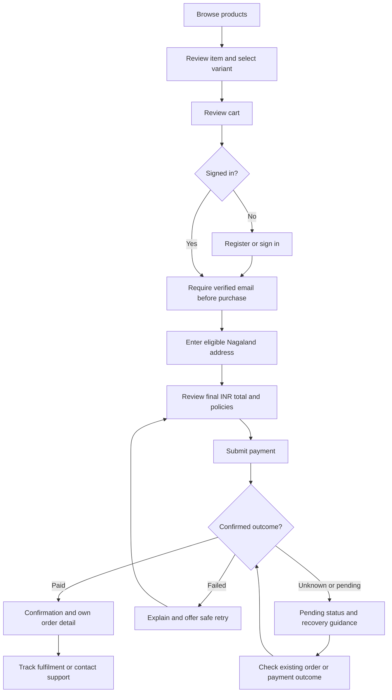
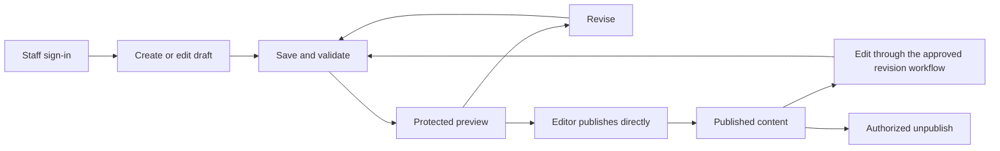

# NUSC platform user flows

Version: User Flows v1.

Status: frozen interaction baseline for Architecture v1 and PRD v1. Conditional branches remain subject to identified PRD decisions. Implementation is not authorized.

Last updated: 14 September 2026.

Decision revision: 1, recorded 14 September 2026 from explicit user answers. D-15 requires verified email before purchase; D-16 includes saved-address management in v1; D-17 uses an order-page cancellation request reviewed by staff. These resolve existing v1 branches. Other open decisions remain open; implementation is not authorized.

Baselines: [ARCHITECTURE.md](./ARCHITECTURE.md) and [PRD.md](./PRD.md). Build tasks remain in [IMPLEMENTATION.md](./IMPLEMENTATION.md).

## Purpose and interpretation

This document describes how visitors, customers, and staff complete the product's tasks: entry points, screens, actions, feedback, successful exits, and consequential recovery paths. It does not define database schemas, provider integration sequences, exact page layouts, or new business policies.

The core journeys form the frozen v1 interaction baseline. Agreed PRD constraints remain fixed: Nagaland-only delivery, INR pricing/payment, account-required checkout, and direct publication by content editors. A Baseline flow does not approve unresolved policy details or promote a proposed PRD feature into agreed scope. Conditional and Optional branches retain the status defined below.

Screen names and action labels are descriptive, not finalized wireframes or URLs. The supplied shop reference is a design/layout input for the frontend preview only. No product names, prices, stock counts, delivery promises, approval roles beyond those agreed, or provider-specific screens are invented.

The user resolved D-15, D-16, and D-17 on 14 September 2026, recorded in PRD v1 decision revision 1. The selected branches below are required v1 scope; the alternatives are not selected. Remaining method, policy, and provider details retain their open status.

### Flow status

- **Baseline** — the core journey is required by frozen PRD v1 scope.
- **Selected** — a previously conditional branch explicitly chosen through a dated PRD decision; required in v1, with remaining detail dependencies identified.
- **Conditional** — the branch depends on an unresolved PRD decision; the identified choice must be settled before implementing that branch.
- **Optional** — the feature is tied to a Should/Could scope item and is not required for launch.

Each major flow is labelled Baseline for its core task. Conditional and Optional parts within it do not become mandatory merely because the parent flow is Baseline. Permission preconditions apply at the time of the protected action, not only when its screen first opens.

| Branch or feature                                                   | Status      | Location                                                                  |
| ------------------------------------------------------------------- | ----------- | ------------------------------------------------------------------------- |
| Purchase email-verification policy | Selected | D-15: verified email required before purchase; UF-04/UF-05/UF-06/UF-07 |
| Saved-address management | Selected | D-16: included in v1; UF-05/UF-08 |
| Order-page cancellation request with staff review | Selected | D-17: included in v1; UF-09/UF-16 |
| Dedicated team/player pages, competition filters, season navigation | Optional    | UF-01, as described by the PRD                                            |
| Staff low-stock list                                                | Optional    | UF-14; threshold and ownership still require a decision                   |

Other provider, role, retention, and policy dependencies remain Conditional where identified in the decision-gate table. This terminology records interaction scope, not completion or test status.

## Shared interaction rules

- Let visitors read club content and browse merchandise without sign-in. Require an authenticated customer before delivery/payment checkout and private order access.
- Use the NUSC typography, colors, crest, and responsive behavior. The club website, shop, and staff dashboard may have different task-specific navigation.
- Preserve safe user input after recoverable failures. Never retain payment secrets or reveal a previous user's account/address/order information after sign-out or identity change.
- Show meaningful progress for slow work. Prevent accidental repeated submissions, but allow recovery after a failed attempt. A spinner or disabled button alone is not an explanation.
- Put field errors next to the field and provide a clear route to the first error. Do not clear unrelated valid fields or announce success before confirmation.
- Support keyboard navigation and visible focus. Dialogs have an accessible title, controlled entry/return focus, and a dismissal route when appropriate. Important status is conveyed with text, not only color.
- When a protected session expires, stop the action, explain sign-in is needed, and return to the permitted task after authentication. Recheck the latest state before retrying; do not automatically replay payments, refunds, publishing, or permission changes.
- Make costs and destructive consequences visible before committing. Use an explicit review for payment, refund, stock correction, archive/unpublish, or permission changes when their consequences warrant it; routine field edits need no extra approval ritual.
- Do not treat an order number, link destination, hidden control, or known staff email as proof of access. A denied view reveals no private record details.
- Exact sign-in method, timing limits, policy text, support channels, and operational permissions come from the PRD decisions. No placeholder default becomes a public promise.
- A shopper may intentionally leave checkout without completing a confirmed order. On return, revalidate authentication, price, stock, delivery eligibility, cart state, and any existing payment attempt. Leaving is not cancellation, proof of payment failure, or a reason to create another charge; an already-started payment may still complete and must be resolved.
- Notifications report business state; they never create or define it. A delayed or failed notification does not change the underlying order, payment, refund, or fulfilment state.

## Flow index and requirement traceability

Requirement and decision IDs below refer to PRD v1. UX-01 through UX-06 and Q-01 through Q-05 apply across relevant flows.

| Flow  | Actor and task                                             | PRD requirements                               | Main open dependencies |
| ----- | ---------------------------------------------------------- | ---------------------------------------------- | ---------------------- |
| UF-01 | Visitor explores club content and opportunities            | WEB-01, WEB-02, WEB-03, WEB-04, WEB-05, WEB-06 | D-11, D-12             |
| UF-02 | Shopper browses and selects merchandise                    | SHOP-01, SHOP-02, SHOP-03                      | D-04, D-09             |
| UF-03 | Shopper reviews and edits cart                             | SHOP-04, SHOP-05, SHOP-13                      | D-09, D-13             |
| UF-04 | Customer registers, signs in, verifies, or recovers access | SHOP-13, SHOP-14                               | D-13, D-15             |
| UF-05 | Customer supplies delivery details and reviews total       | SHOP-06, SHOP-07, SHOP-12                      | D-06, D-07, D-16       |
| UF-06 | Customer pays and recovers an uncertain outcome            | SHOP-08, SHOP-09                               | D-05, D-09             |
| UF-07 | Customer views orders, tracking, and notifications         | SHOP-09, SHOP-10, SHOP-11                      | D-06, D-07, D-10       |
| UF-08 | Customer manages profile, addresses, and deletion request  | SHOP-14, Q-03                                  | D-13, D-16             |
| UF-09 | Customer contacts support or requests cancellation/return  | SHOP-11, SHOP-12, OPS-06                       | D-08, D-10, D-17       |
| UF-10 | Staff signs in and reaches authorized work                 | ADM-02, ADM-04                                 | D-13                   |
| UF-11 | Editor drafts, previews, publishes, or withdraws content   | CMS-01, CMS-02, CMS-03, CMS-05, CMS-06         | D-11, D-12, D-13       |
| UF-12 | Editor manages editorial media                             | CMS-04                                         | D-11, D-12, D-13       |
| UF-13 | Store manager creates, publishes, or archives a product    | OPS-01, ADM-03                                 | D-04, D-09, D-13       |
| UF-14 | Store manager records and adjusts stock                    | OPS-02, ADM-03                                 | D-09, D-13             |
| UF-15 | Store staff finds, prepares, and dispatches an order       | OPS-03, OPS-04, OPS-06                         | D-06, D-10, D-13       |
| UF-16 | Authorized staff handles cancellation, return, and refund  | OPS-05, ADM-03                                 | D-05, D-08, D-13, D-17 |
| UF-17 | Administrator invites, changes, or disables staff          | ADM-01, ADM-02, ADM-03, ADM-04                 | D-13                   |

## Purchase journey overview

D-15 now requires verified email before purchase. The diagram shows the prerequisite; exact screen placement and verification method remain open. Payment initiation must enforce the requirement server-side. Status checks do not submit another payment. A pending shopper may leave and later resume through their account; the loop does not require remaining on a page or polling indefinitely.

## UF-01 — Explore club content and opportunities

**Status:** Baseline.

**Actor:** visitor. **Precondition:** No account is required for public content; only published, approved information is exposed. **Entry:** homepage, shared link, search result, or existing legacy link. **Successful exit:** the visitor finds current public information or reaches the intended enquiry/application route.

| Step/view                  | User action                                                                    | Expected response and next state                                                                                                                     |
| -------------------------- | ------------------------------------------------------------------------------ | ---------------------------------------------------------------------------------------------------------------------------------------------------- |
| Home or direct public page | Read the introduction or open navigation                                       | Preserve the Rise Together opening and existing page identity; navigation works on phone and desktop                                                 |
| Club navigation            | Choose Club, Honours, Player Pathway, Community, Partners, Careers, or Contact | Open the relevant existing page; legacy destinations still resolve meaningfully                                                                      |
| News list                  | Choose a published article                                                     | Show its title, date, content, and approved imagery at a stable article address                                                                      |
| Player section             | Read approved player information                                               | Reuse consistent public details; a missing optional photo uses the approved fallback; no dedicated profile page is implied                           |
| Fixture/results view       | Review an upcoming match or recorded result                                    | Under D-11's proposed scope, show launch-season information, labelled IST, known venue, and clear scheduled/completed/postponed/cancelled/TBC status |
| Opportunity/contact area   | Choose the relevant email/social/application action                            | Preserve its actual destination and instructions; opening an email app is not displayed as a sent message                                            |
| Shop entry                 | Follow the Shop link                                                           | Enter the official store; UF-02 begins, with a clear route back to the club website                                                                  |

**Recovery:** empty news/fixture views explain that no items are published; withdrawn or unknown pages offer a useful return route. A loading failure offers retry/navigation rather than invented content. Optional team pages, competition filters, and season navigation appear only if approved. Public youth-player fields and imagery are shown only after required club approval.

## UF-02 — Browse and select merchandise

**Status:** Baseline.

**Actor:** visitor or signed-in customer. **Precondition:** The product is publicly visible; adding requires a currently purchasable variant and valid quantity. Sign-in is not required to browse. **Entry:** shop landing/category page or shared product link. **Successful exit:** the chosen purchasable variant and quantity are added to the cart with understandable feedback.

| Step/view               | User action                             | Expected response and next state                                                                                                  |
| ----------------------- | --------------------------------------- | --------------------------------------------------------------------------------------------------------------------------------- |
| Catalogue/category      | Browse kits or accessories              | Show official item names/images, INR prices, and availability; communicate Nagaland-only delivery                                 |
| Product detail          | Inspect images, description, and sizing | Size-dependent products expose a usable guide/measurements before adding; care information appears where supplied                 |
| Variant selection       | Choose required size/other variant      | Show the selected choice, its price, and proposed In stock/Out of stock wording; no exact public stock counts or invented urgency |
| Quantity and add action | Choose a permitted quantity and add     | Validate selection/availability, then acknowledge the actual added variant and quantity                                           |
| Added feedback          | Continue shopping or open cart          | Preserve selection context and provide an accessible route to UF-03; cart drawer/page details remain dependent on the approved store implementation scope |

**Recovery:** missing required choices produce a nearby instruction. Unavailable variants cannot be added; the shopper can choose another available variant. A removed/archived item has no purchase action and offers catalogue navigation. An image failure has a fallback; absent required sizing data must not be concealed. If adding fails, do not increase the visible cart count as though it succeeded.

## UF-03 — Review and edit cart

**Status:** Baseline.

**Actor:** visitor or customer. **Precondition:** The cart is associated with the current visitor/customer context; a valid cart and authenticated customer are required before progressing into checkout. **Entry:** cart action after adding, header cart link, or return from authentication. **Successful exit:** a reviewed, valid cart proceeds to authenticated checkout or the user chooses to keep shopping.

| Step/view           | User action                                                 | Expected response and next state                                                                                                                                                  |
| ------------------- | ----------------------------------------------------------- | --------------------------------------------------------------------------------------------------------------------------------------------------------------------------------- |
| Cart                | Inspect items                                               | Display name, selected variant, quantity, unit price, line total, and available subtotal information; delivery charges are not falsely shown as final before eligibility is known |
| Edit cart           | Change quantity or remove an item                           | Recalculate displayed totals; explain limits or availability changes; an empty cart offers catalogue navigation                                                                   |
| Changed item review | Resolve a changed price, sold-out variant, or archived item | Identify the affected item and new state; let the shopper revise/remove it; do not silently substitute a size or charge a changed amount                                          |
| Checkout entry      | Choose checkout                                             | If not signed in, open UF-04 in purchase context; otherwise apply the selected verification policy and proceed to UF-05                                                           |
| Return from sign-in | Review any restored/merged cart                             | Retain safe selections; explain any conflicts and revalidate them before payment                                                                                                  |

**Recovery:** if cart state cannot be loaded, offer retry and keep the user out of an unknown-total payment path. Persistence duration and merge behavior remain D-09/D-13 details; do not silently double quantities when combining carts. A session change must not expose a previous customer's saved addresses or orders. Anonymous-to-customer cart association or customer identity changes must never expose another customer's cart or silently replace a known cart without review. The precise merge policy remains open.

## UF-04 — Register, sign in, verify, and recover access

**Status:** Baseline.

**Actor:** shopper/customer. **Precondition:** No active session is required to enter account recovery/sign-in. Access to a resumed protected task requires successful authentication and any approved verification gate. **Entry:** checkout gate, account link, protected order link, or expired-session recovery. **Successful exit:** the correct customer is authenticated and can return to their permitted task; the selected verification policy is satisfied before any gated purchase action.

| Step/view                 | User action                                                                           | Expected response and next state                                                                                         |
| ------------------------- | ------------------------------------------------------------------------------------- | ------------------------------------------------------------------------------------------------------------------------ |
| Account entry             | Choose sign-in or registration                                                        | Offer both in the current purchase context; no requirement to register on an earlier visit                               |
| Registration              | Supply the selected method's required identity fields and intentional account consent | Validate fields without losing safe inputs; explain the next step; do not opt into marketing                             |
| Sign-in                   | Complete the selected authentication method                                           | On success, return to the cart/checkout or authorized order/account destination; on failure, provide retry/recovery      |
| Verification | Complete the required D-15 verification | Explain pending verification and recovery; do not permit purchase until verified |
| Recovery                  | Request and complete the selected recovery method                                     | Provide a privacy-preserving acknowledgement and instructions; expired/invalid recovery challenges offer a fresh request |
| Resume                    | Return to the original task                                                           | Restore permitted cart context and check the current order/stock/permission state; no automatic payment resubmission     |

### D-15 selected verification branch

**Status:** Selected — require verified email before purchase; agreed 14 September 2026.

Show a clear verification-needed state, destination guidance with appropriate masking, resend/retry options, and a route to correct the identity through the approved account process. Enforce verified email server-side before payment initiation. Preserve permitted cart context when returning from verification. Exact screen placement, method, resend limits, and recovery mechanics remain open.

Purchase before email verification is not selected. Password, one-time-code, magic-link, or social-sign-in screens are not all required by this choice.

**Recovery and sign-out:** preserve a recoverable non-sensitive cart when a session expires, direct the user safely to sign-in, and recheck their action after return. Sign-out immediately hides private account/order/address information. Do not copy private data to an anonymous cart for convenience. Shared-device cart retention and identity-change handling require D-13 sign-off.

## UF-05 — Enter delivery details and review the payable total

**Status:** Baseline.

**Actor:** authenticated customer meeting any selected verification gate. **Precondition:** The customer has an authenticated session, a valid cart, and satisfies any approved verification gate for this step; current delivery eligibility must be established before payment. **Entry:** validated cart. **Successful exit:** the customer explicitly proceeds with an eligible Nagaland address and reviewed final INR total.

| Step/view                   | User action                                                                               | Expected response and next state                                                                                                  |
| --------------------------- | ----------------------------------------------------------------------------------------- | --------------------------------------------------------------------------------------------------------------------------------- |
| Delivery details            | Enter the required recipient/contact/address information                                  | Use meaningful labels and appropriate input types; request only approved fulfilment fields                                        |
| Address choice | Select an owned saved address or enter a new one | Offer explicit save/manage actions; choosing a saved address never bypasses current eligibility checks |
| Eligibility                 | Continue with the address                                                                 | Check actual serviceable coverage within Nagaland; reject outside-state or unsupported postcodes before payment                   |
| Delivery option/expectation | Review available service and charges                                                      | Show only real approved options, charges, dispatch estimate and any defensible delivery estimate; do not invent multiple services |
| Final review                | Inspect items, quantities, address, shipping, taxes/charges, and final INR payable amount | Provide edit routes and accessible policies; changed values require renewed review                                                |
| Payment entry               | Choose to pay the reviewed amount                                                         | Proceed to UF-06; a required policy acknowledgement follows the approved policy and is not marketing consent                      |

### D-16 selected address branch

**Status:** Selected — saved-address management included in v1; agreed 14 September 2026.

Offer an owned saved address or a new address, with an explicit save/manage route. Apply UF-08 for adding, editing, selecting, and removing saved addresses. Check ownership on every protected operation and recheck selected/edited addresses against current Nagaland coverage. Changes affect future selection; they do not rewrite a placed order's address or automatically reroute it.

The checkout-entry-only scope without address management is not selected.

**Recovery:** link address errors to fields; preserve other permitted values. An eligibility service failure is not evidence that the address is supported. Return to editing/cart when price, stock, or delivery changes invalidate the review. Do not accept an outside-Nagaland address merely because the user selected a Nagaland label.

## UF-06 — Pay and resolve the outcome

**Status:** Baseline.

**Actor:** authenticated customer. **Precondition:** The customer is authenticated, has a verified email as required by D-15, and has reviewed a valid cart, eligible Nagaland address, and current INR total. Any existing payment attempt is checked before a new attempt. **Entry:** reviewed eligible checkout. **Successful exit:** a verified outcome is clearly shown, or the customer has a safe recovery route for an existing pending/failed attempt.

| Step/view            | User action                                       | Expected response and next state                                                                                                        |
| -------------------- | ------------------------------------------------- | --------------------------------------------------------------------------------------------------------------------------------------- |
| Payment action       | Submit the reviewed payment intent                | Show progress and guard accidental repeated submission; the actual provider screen/redirect is decided under D-05                       |
| Provider interaction | Complete, cancel, or leave the payment process    | Return to a status view when possible; leaving the provider does not itself establish success or failure                                |
| Outcome check        | Wait for or request the current outcome           | Show Paid, Payment failed, or Pending payment according to confirmed information                                                        |
| Confirmed paid       | Review confirmation                               | Show stable order reference, purchased variants/quantities, paid total and delivery summary; link to UF-07                              |
| Confirmed failure    | Review explanation and retry option               | Allow a safe return to review after rechecking cart/amount; do not silently resubmit                                                    |
| Pending/unknown      | Read next-step guidance or leave and return later | Keep an existing order/payment reference when available; explain whether action or waiting is needed and provide a support/status route |

**Recovery:** refresh, browser Back, closing a tab, network loss, or session expiry must not create a second purchase. A timeout must not be presented as a definitive failed charge. Check the existing outcome before permitting a new attempt when status is uncertain. If a payment is confirmed but the order view is temporarily unavailable, show a recovery/support state rather than asking the customer to pay again. Do not claim that stock is reserved for a particular duration until D-09 defines it.

## UF-07 — View orders, tracking, and transactional updates

**Status:** Baseline.

**Actor:** signed-in customer. **Precondition:** An authenticated customer may access only their own orders. An unauthenticated notification/deep-link entry must pass sign-in and ownership checks before private details are shown. **Entry:** confirmation, account order history, or a notification link. **Successful exit:** the customer understands the current state, can obtain the approved purchase document, and knows the next action or support route.

| Step/view          | User action                                        | Expected response and next state                                                                                   |
| ------------------ | -------------------------------------------------- | ------------------------------------------------------------------------------------------------------------------ |
| Order history      | Open their account orders                          | Show only owned orders; empty history links to shopping                                                            |
| Order detail       | Select an order or follow its notification link    | Require sign-in if necessary, then verify access; show stable reference and order-line/total snapshots             |
| Status summary     | Review payment, fulfilment, and refund information | Keep these categories separate; Paid is not Dispatched, and Cancelled is not automatically Refunded                |
| Tracking           | Follow available dispatch/tracking information     | Show only recorded, confirmed information and an approved carrier link; no live-map or delivery promise is assumed |
| Purchase documents | Open an available required invoice/receipt         | Follow D-07's approved format; order confirmation is not labelled a tax invoice without that policy                |
| Support            | Choose help for this order                         | Enter UF-09 with the order reference, without granting another person access to the order                          |

Use the PRD's proposed vocabulary: Pending payment, Payment failed, Paid; Processing, Dispatched, Delivered; Cancelled; Refund pending, Refunded, conditionally Partially refunded, and Refund needs attention. Show confirmed amounts for refunds. Exact transitions and partial-refund support follow the approved policy. Processing is an explicitly recorded fulfilment state, not automatically inferred from payment success. Delivered may be shown only when the approved carrier or staff process provides reliable confirmation.

**Recovery:** an unauthorized/missing order gives a neutral unavailable result and an account/support route without exposing its contents. A stale notification opens the current order state. If tracking or a fiscal document is temporarily unavailable, explain and offer retry/support rather than a broken download or invented delivery state.

### Transactional notification touchpoints

| Event                                 | Customer-facing journey                                                     | Constraint                                                                           |
| ------------------------------------- | --------------------------------------------------------------------------- | ------------------------------------------------------------------------------------ |
| Order confirmed                       | Message/confirmation links to owned order detail                            | Include approved summary and support route; no duplicate contradictory confirmations |
| Failed/pending payment needing action | In-app state and approved outbound message lead to existing status/recovery | Do not invite a new payment while an earlier attempt remains uncertain               |
| Dispatched                            | Update links to order detail and available tracking                         | Never claim dispatch before confirmation                                             |
| Refund completed                      | Update identifies confirmed amount and order                                | Distinguish refund completion from any approved banking settlement guidance          |
| Cancellation confirmed, if included   | Update shows cancellation separately from refund                            | Notification priority/scope follows PRD                                              |

Email is a proposed channel, not a selected provider. A failed notification does not invalidate an order or force repurchase. Private details must not be disclosed through an unverified recipient or unsecured link; D-10/D-13/D-15 must resolve the actual delivery and verification flow.

## UF-08 — Manage customer information and deletion requests

**Status:** Baseline.

**Actor:** signed-in customer. **Precondition:** The customer is authenticated and owns the profile or address being accessed; changes and deletion requests follow the approved identity/retention policy. **Entry:** account area. **Successful exit:** an authorized change is confirmed, or a deletion request has a defined acknowledgement and support process.

| Step/view                              | User action                                           | Expected response and next state                                                                                                                                 |
| -------------------------------------- | ----------------------------------------------------- | ---------------------------------------------------------------------------------------------------------------------------------------------------------------- |
| Account profile                        | Review permitted identity/contact fields              | Show only their information; no biography or marketing profile is added without scope approval                                                                   |
| Edit details                           | Change a supported field                              | Validate and confirm saved data; identity/contact changes follow the selected verification policy                                                                |
| Address book | Add, edit, choose, or remove an owned saved address | Changes affect future selection, not historical order snapshots or automatic rerouting of a placed order; enforce ownership server-side |
| Privacy/deletion help                  | Request account deletion through the approved channel | Explain the approved effect on access and retained records; verify identity before action; acknowledge the request without falsely claiming immediate completion |
| Sign-out                               | End the session                                       | Hide private information and apply UF-04's shared-device/cart rules                                                                                              |

**Recovery:** validation errors retain safe input. Failed saves leave the last confirmed state clear. A lost session returns to sign-in without showing cached private data to another identity. Deletion does not automatically cancel an active order or erase required financial history; the club-approved policy governs fulfilment, retention/anonymization, and request completion. A full self-service deletion tool and marketing preference center are not implied.

## UF-09 — Request support, cancellation, return, or exchange

**Status:** Baseline.

**Actor:** customer; unauthenticated visitors may read public policy/contact details. **Precondition:** Public policy/contact details need no account. Private order access or an in-app order request requires an authenticated owner; support verifies identity before disclosing records or taking protected action. **Entry:** order detail or purchase policy/support link. **Successful exit:** a request reaches the approved process, its status is clear, and the customer understands that a request is not a confirmed cancellation/refund.

1. Read the relevant approved policy and support contact. Do not display invented eligibility periods or response times.
2. Identify the order and issue through the approved channel, with only necessary information. Email is proposed; phone, WhatsApp, and forms are not all included by default.
3. Receive the selected channel's acknowledgement where supported. An opened email compose window is not evidence that a message was sent or received.
4. Staff verifies identity, checks the latest order state/policy, and uses UF-16 for any operational action.
5. The customer receives the approved response and sees any confirmed state/amount in UF-07.

### D-17 selected cancellation branch

**Status:** Selected — order-page request with staff review; agreed 14 September 2026.

An eligible signed-in customer opens a cancellation-request action on their own order page, reads its scope, supplies required information, and submits. Verify ownership and current eligibility server-side. Show acknowledgement/pending review and prevent duplicate requests. Authorized staff review the request in UF-16 under the approved policy; show the decision and confirmed cancellation/refund separately. This is not automatic cancellation or an automatic refund.

Support-only initiation is not the selected v1 scope. Public policy and support routes remain available. D-08 still determines eligibility, time limits, and refund handling.

**Recovery:** if the order is already dispatched or the request is ineligible, explain the applicable support/return path without promising acceptance. If a request submission fails, distinguish retryable failure from an unknown submission outcome before resending. No cancellation/refund window, return address, fee, or exchange promise is set by this flow.

## Staff entry and task boundaries

Staff use the admin application and staff identity; store customer sign-in never grants staff access. The proposed mobile-admin minimum covers sign-in, order lookup/detail, permitted fulfilment/tracking updates, and sign-out. Desktop supports the full approved workflow. Other mobile tasks are conditional; do not present broken or inaccessible controls as supported.

## UF-10 — Sign in to staff work

**Status:** Baseline.

**Actor:** invited/authorized editor, store manager, or administrator. **Precondition:** No active staff session is required at entry. Continuing to protected work requires an eligible invited/active staff identity, successful authentication, any required MFA, and current task permissions. **Entry:** admin address or authorized deep link. **Successful exit:** verified staff reaches a permitted task.

1. Open staff sign-in; no public self-registration is offered.
2. Complete the selected staff credentials and any required MFA. MFA method and recovery remain D-13 choices.
3. Enter role-specific navigation: editors reach content/drafts, store staff reach orders/products, administrators reach allowed staff/settings tasks. No custom KPI dashboard is required.
4. Open an allowed task or resume an authorized deep link. Check permissions for the action, not just its menu visibility.
5. Sign out when finished; private staff views no longer remain accessible.

**Recovery:** invalid credentials have a useful sign-in/recovery path without leaking account details. Expired invites, disabled accounts, and missing permissions provide the appropriate contact/access response. Session expiry interrupts protected actions; after sign-in, reload the current record and request deliberate resubmission where needed. Store manager/editor roles do not automatically include each other's capabilities.

## Editorial journey overview

There is no administrator approval step for an editor's publication. Permissions for unpublishing, published-content revisions, and media deletion remain subject to the final role matrix and CMS editing rules.

## UF-11 — Draft, preview, publish, and maintain club content

**Status:** Baseline.

**Actor:** content editor or another explicitly permitted staff role. **Precondition:** The staff session is active and has current permission for the content operation. Publication requires valid content and any required public-data/media approvals. **Entry:** content area after UF-10. **Successful exit:** saved work is accurately previewed/published, or an authorized withdrawal is reflected publicly.

| Step/view           | User action                                                      | Expected response and next state                                                                                              |
| ------------------- | ---------------------------------------------------------------- | ----------------------------------------------------------------------------------------------------------------------------- |
| Content list        | Choose news, players, fixtures, or another approved content area | List relevant records and publication state; create/edit controls follow permissions                                          |
| Editor              | Enter or update approved structured fields                       | Display required fields and validation; use UF-12 for editorial media                                                         |
| Save draft          | Save without publishing                                          | Confirm durable draft save; existing public content is not silently changed by a draft action                                 |
| Protected preview   | Review the rendered result                                       | Clearly identify draft/preview context; permit return to edit; public visitors cannot access private draft content            |
| Publish             | Deliberately publish valid content                               | Editors publish directly; report success only when accepted, and distinguish that from propagation to the public page         |
| Public verification | Open the public destination                                      | Verify the approved content appears within the agreed freshness target; retain an actionable issue state if propagation fails |
| Maintain/withdraw   | Edit the next revision or explicitly unpublish if allowed        | Show the effect on public access; do not treat withdrawal as permanent deletion of editorial history                          |

**Content-specific branches:** news requires its approved title/content/date/URL fields; player edits expose only approved public fields; fixtures use the selected season/team, known date/time/venue, labelled timezone, and accurate status/result. Unknown kickoff/venue stays TBC; a postponed match is not silently deleted. Close expired careers through approved fields. Team references do not require new public team pages.

**Recovery:** field errors preserve input. If saving/publishing fails, distinguish unsaved work from the last confirmed draft/publication. Warn before navigation would discard known unsaved changes without assuming autosave exists. When a concurrent edit is detected, show that a newer version exists and require review rather than silently overwriting it. Youth-player records/media cannot publish without required approvals. A publication accepted but not yet visible needs status/revalidation recovery, not repeated duplicate articles. After withdrawal takes effect within the approved removal/freshness rules, the public route resolves to its approved unavailable/not-found behavior rather than continuing to expose withdrawn content. Stale-cache removal failure remains an issue to resolve, not a successful withdrawal outcome.

## UF-12 — Upload, select, replace, or remove editorial media

**Status:** Baseline.

**Actor:** editor with media permissions. **Precondition:** The staff session has current media permissions; the asset and affected content are within the staff member's allowed scope. **Entry:** content editor media field or media library. **Successful exit:** an approved asset is referenced correctly, or an authorized deletion/replacement completes without silently breaking retained content.

1. Choose an existing permitted asset or upload a supported file.
2. Show progress and reject unsupported type/size with a clear explanation; limits await the implementation policy.
3. Supply required alt text/attribution and verify the preview before attaching the asset to content.
4. Save the reference through UF-11; an upload alone does not publish a news/player record.
5. For replacement/removal, distinguish detaching an asset from one record from deleting the shared file. Show known references and the permitted action before a consequential deletion.

**Recovery:** failed uploads preserve surrounding editorial input and do not show a broken asset as complete. Referenced-file deletion is blocked or handled through the approved replacement process. Restricted assets remain protected even if their delivery URL fails. Product images are managed through UF-13's commerce context, not a duplicate editorial product record.

## UF-13 — Create, publish, update, or archive merchandise

**Status:** Baseline.

**Actor:** authorized store manager. **Precondition:** The staff session has current permission for product editing/publication or archival. The latest product state and required sale information must be reviewed before committing changes. **Entry:** products area after UF-10. **Successful exit:** one accurate commerce product/variant record is saved and appropriately visible or archived.

| Step/view           | User action                                                                     | Expected response and next state                                                                                                         |
| ------------------- | ------------------------------------------------------------------------------- | ---------------------------------------------------------------------------------------------------------------------------------------- |
| Product list        | Create a draft or open an existing product                                      | Display Draft/Published/Archived separately from availability                                                                            |
| Product editor      | Enter official description, category, variants, INR prices, and product imagery | Validate required details; size-dependent variants need usable sizing information                                                        |
| Initial stock       | Set opening stock for an eligible new variant                                   | Use UF-14; do not overwrite existing sales/stock as part of a generic product save                                                       |
| Review              | Inspect saved product details before publication                                | Keep incomplete/unpublished products unpurchasable; no public draft access is implied                                                    |
| Price-change review | Review a proposed price change                                                  | Show the affected product/variant, current price, and new INR price; require intentional confirmation before committing the price change |
| Publish/update      | Confirm valid publication or permitted changes                                  | Show actual outcome; price changes are attributed; customers review changed values before paying                                         |
| Archive             | Review and confirm the removal from purchase                                    | Stop new purchases while preserving historical order detail; resolve affected carts clearly                                              |

**Recovery:** missing images/sizing/price fields needed for sale prevent publication with actionable errors. Save failure preserves safe draft input. If the product changed since it was loaded, do not silently overwrite newer confirmed data: show the conflict and require review or conflict resolution before saving. Recheck the current price if a price-change review becomes stale. Inventory concurrency remains governed separately by UF-14. A published out-of-stock variant remains an availability condition, not an automatic archive. Restore/unarchive behavior is not added without a scope decision. Product images and marketing content remain part of the canonical commerce product.

## UF-14 — Set opening stock and record adjustments

**Status:** Baseline.

**Actor:** staff with inventory permission. **Precondition:** The staff session has current inventory permission for the selected variant; the stock operation is allowed under the approved stock policy and respects committed/reserved quantities. **Entry:** variant inventory view, or approved staff low-stock list. **Successful exit:** a reasoned, attributable stock operation is confirmed with its resulting quantity.

1. Open the exact product variant and inspect relevant recorded/available/committed quantities.
2. For a new eligible variant, enter opening stock. For ongoing changes, choose a positive/negative adjustment under the proposed D-09 model.
3. Enter the quantity and reason; review the variant, direction, and resulting quantity before committing.
4. Submit once and show progress. On success, display the confirmed result and attribution.
5. Reopen/review inventory as needed. Optional low-stock lists use a staff threshold; they do not create public urgency or automated emails by implication.

**Recovery:** reject an adjustment that would violate availability/commitments. If a concurrent sale or adjustment changes the basis of the review, show current information and require reconsideration. An unknown save result is checked before repeating the adjustment. Physical stock counts do not casually replace live recorded quantities without the approved reconciliation process.

## UF-15 — Find an order and fulfil it

**Status:** Baseline.

**Actor:** staff with order/fulfilment permission. **Precondition:** The staff session has current order/fulfilment permissions. The latest payment and fulfilment state must permit the intended action; viewing an order alone does not authorize dispatch. **Entry:** order list, search by approved fields, or orders-needing-action view. **Successful exit:** the correct order is prepared/dispatched with accurate status and tracking, or an exception is explicitly left for follow-up.

| Step/view          | User action                                                                     | Expected response and next state                                                                                     |
| ------------------ | ------------------------------------------------------------------------------- | -------------------------------------------------------------------------------------------------------------------- |
| Order lookup       | Search/select an order                                                          | Show only authorized results and enough information to identify the order; do not expose unnecessary personal data   |
| Order review       | Inspect payment, item/size/quantity, delivery details, and current fulfilment   | Distinguish paid from pending/failed; block unsupported dispatch actions on unsettled or otherwise ineligible orders |
| Preparation        | Follow the approved picking/packing process                                     | Record permitted Processing/progress information; purchase snapshots remain intact                                   |
| Dispatch           | Enter actual carrier/tracking information where applicable and confirm handover | Record Dispatched only when it happened; do not fabricate a tracking number or delivery estimate                     |
| Customer update    | Confirm status/update result                                                    | UF-07 shows current state; trigger the approved communication without treating email failure as dispatch failure     |
| Delivery follow-up | Record or receive the approved confirmation                                     | Show Delivered only from the agreed source; retain useful exception/support guidance otherwise                       |

**Recovery:** payment uncertainty or a new cancellation request requires rechecking the order before action. Missing/invalid tracking is explained under the actual carrier requirements. Repeat clicks do not dispatch twice. If a status change succeeds but its notification fails, retry communication rather than repeat fulfilment. Carrier booking, labels, partial shipments, and automatic delivery confirmation are not assumed unless approved.

## UF-16 — Review cancellation/return and process a refund

**Status:** Baseline.

**Actor:** authorized operations/refund staff. **Precondition:** The staff session has current permission for the specific cancellation/refund action. Customer/order identity, policy eligibility, and current payment/refund/fulfilment state are verified before commitment. **Entry:** customer request from UF-09, a policy-approved return, or an order exception. **Successful exit:** the customer receives a clear decision and any allowed order/refund action has an accurate, auditable outcome.

1. Identify the customer/order through the approved process and inspect the latest payment, dispatch, prior request, and refund information.
2. Assess the request against D-08: eligibility, time limits, item condition, fees, shipping responsibility, and the allowed initiation route. Do not invent a policy while handling the request.
3. If declined, provide the approved reason/next step. A declined request does not silently change fulfilment or refund status.
4. If accepted, review the proposed action, reason, customer impact, and any physical-return requirements. Before committing a refund, show the original paid amount, already refunded amount, proposed refund, and remaining refundable amount in INR, including any supported partial refunds. Make clear whether the remaining figure is before the proposed refund and show the amount left afterward where relevant. Require intentional confirmation and recheck the financial context if it changes; a pending or uncertain prior refund must be resolved before another potentially overlapping refund.
5. Show confirmed cancellation separately from Refund pending, Refunded, conditionally Partially refunded, or Refund needs attention. The customer-facing result follows UF-07.
6. Handle restocking through the approved return/stock process, not automatically because money was refunded. Notify the customer through the selected channel.

**Recovery:** insufficient permission routes to an authorized role. Already-handled or conflicting requests are reviewed rather than duplicated. An unknown refund outcome is checked before a new refund is attempted. Refund failure does not appear completed; a dispatched/delivered item is not returned to available stock without the required physical/process confirmation. Exchanges, partial refunds, and automatic self-service cancellation remain policy/scope dependent. The selected D-17 customer request always requires staff review.

## UF-17 — Invite, change permissions, or disable staff

**Status:** Baseline.

**Actor:** administrator with the relevant staff-management permission. **Precondition:** The administrator has an active staff session and current permission for the specific staff-management action; the target and intended permission change are within that scope. **Entry:** staff management after UF-10. **Successful exit:** the intended staff access is accurately granted, changed, or removed with an audit record.

| Step/view      | User action                                                    | Expected response and next state                                                                                             |
| -------------- | -------------------------------------------------------------- | ---------------------------------------------------------------------------------------------------------------------------- |
| Staff list     | Inspect or invite a staff member                               | Show permitted staff information; invitations do not create customer privileges or public signup                             |
| Invitation     | Supply required identity and intended role                     | Review permissions and send through the selected process; distinguish created invite from confirmed delivery/acceptance      |
| Acceptance     | Invited staff completes the approved setup and MFA if required | Establish staff access only after the required steps; expired/invalid invitations offer safe administrator-assisted recovery |
| Role change    | Review the exact added/removed capabilities and confirm        | Enforce the new permissions and attribute the change; do not infer privilege from customer account data                      |
| Disable access | Review impact and confirm                                      | Prevent further protected actions as required by PRD; retain relevant audit attribution                                      |

**Recovery:** failed or duplicate invitations are handled without silently creating multiple staff identities. Prevent unauthorized self-elevation. Final rules for self-role changes, the last administrator, invitation expiry, MFA recovery, and reactivation remain Conditional on D-13 before those branches are implemented. After a staff account is disabled or a permission is removed, existing sessions must not continue performing the removed protected operations once that change takes effect. This applies to already-open editing screens as well as new navigation; stop disallowed actions and provide a safe response without exposing data.

## Decision-dependent branches and sign-off gates

| Decision   | Affected flows                    | What must be settled before dependent interaction implementation                                                         |
| ---------- | --------------------------------- | ------------------------------------------------------------------------------------------------------------------------ |
| D-04       | UF-02, UF-13                      | Real products, variants, sizes, prices, images, and required catalogue fields                                            |
| D-05       | UF-06, UF-16                      | Actual payment methods/provider journey and refund capability                                                            |
| D-06, D-07 | UF-05, UF-07, UF-15               | Nagaland serviceability, charges, estimates, fulfilment/tracking and purchase-document rules                             |
| D-08, D-17 | UF-09, UF-16 | D-17 selected: order-page request with staff review. D-08 eligibility, returns/exchanges, and refund rules remain open. |
| D-09       | UF-03, UF-06, UF-14               | Stock/reservation behavior, quantity limits and adjustment/reconciliation rules                                          |
| D-10       | UF-07, UF-09, UF-15, UF-16        | Support channel/contact/process and notification channel/content                                                         |
| D-11, D-12 | UF-01, UF-11, UF-12               | Public team/player scope, English/IST defaults, editable fields, permissions for youth content and publication freshness |
| D-13       | UF-03, UF-04, UF-08, UF-10, UF-17 | Sign-in/recovery, identity changes, shared-device cart policy, staff roles/MFA and privacy/deletion handling             |
| D-15 | UF-04, UF-05, UF-06, UF-07 | Selected: verified email before purchase. Screen placement, method, resend, and recovery details remain open. |
| D-16 | UF-05, UF-08 | Selected: saved-address management. Fields/serviceability depend on D-06; privacy/session details depend on D-13. |
| D-14       | All applicable flows              | Agreed device coverage, performance expectations, operating owners, and release readiness                                |

Owners and needed-by milestones are recorded in PRD v1. Drafting alternative branches here is useful preparation; it does not authorize guessing answers during implementation. Flow refinements that change frozen product scope must go through the PRD decision process, and architectural changes through the ADR process.

## Review and validation checklist

This is planned review coverage, not evidence that a UI exists or has been tested.

- Walk UF-01 through public content and its empty/withdrawn states while preserving existing enquiry interactions.
- Walk UF-02 through UF-07 for a successful authenticated Nagaland purchase, including size guidance, final INR cost, and order tracking.
- Exercise changed stock/price, unsupported postcode, failed sign-in, expired session, failed payment, unknown payment, duplicate clicks, and return-after-closing-tab recovery.
- Verify the selected D-15/D-16/D-17 branches: unverified purchase denial/recovery; owned saved-address management and delivery validation; owned cancellation requests, deduplication, and staff review. Resolve remaining method/policy details with their owners.
- Verify that another customer's order link, a signed-out screen, and a customer session at the staff app disclose no private data or permissions.
- Walk editor publication directly, without an added administrator approval step, and inspect failure/unpublish/media-reference recovery.
- Walk product publication, stock correction, fulfilment, and refund using roles that both allow and deny the operation.
- Check order, payment, fulfilment, refund, and notification wording for consistent confirmed/pending meanings.
- Review keyboard focus, zoom, reduced motion, meaningful status announcements, and the proposed mobile-admin subset on representative devices.
- Review staff invitations, permission changes, session revocation, and sensitive-action attribution against the final role matrix.

User Flows v1 freezes the interaction baseline for Architecture v1 and PRD v1. Unresolved branches remain Conditional and Optional features remain outside mandatory launch scope until selected through the product decision process. Material interaction changes must update this document and their affected requirement/decision references. Architecture v1 is unchanged; PRD v1 decision revision 1 records the selected customer branches. Freezing these flows does not authorize implementation, provisioning, or deployment.
